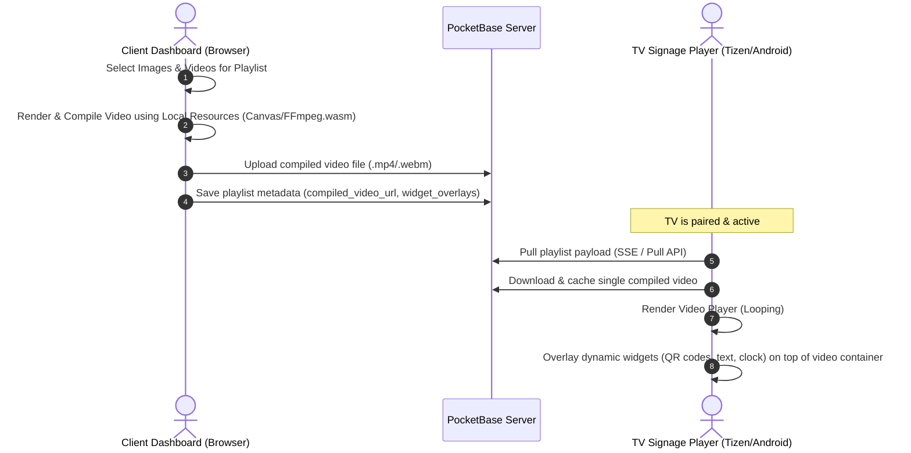

# Client-Side Video Compilation for Playlists

This document details the architectural design and implementation plan to compile media playlists (images, videos, and transitions) into a single, optimized video file directly within the client browser. This approach shifts the rendering load away from low-resource TV player hardware, reduces local bandwidth requirements, and guarantees smooth video looping, while keeping interactive widgets (like QR codes and ticker text) dynamic.

---

## 1. System Architecture & Workflow

Instead of the TV player downloading multiple individual images and videos and scheduling their transitions locally, the client portal compiles them into a single `.mp4` / `.webm` video container during playlist creation or updates.

### High-Level Workflow Sequence



---

## 2. Client-Side Video Generation Technologies

There are two primary methods to compile media into a single video file inside the browser:

### Option A: HTML5 Canvas + MediaRecorder API (Recommended for Animations & Canvas-drawn elements)
This technique involves rendering images, video frames, and animations onto an offscreen `<canvas>` at a constant frame rate, capturing the stream, and saving it via the `MediaRecorder` API.

* **Pros:**
  * Native browser support; no external heavy WebAssembly binaries required.
  * Very easy to capture CSS/JS animations and custom text overlays.
  * Low CPU overhead during basic rendering.
* **Cons:**
  * The encoding bitrate and container format depend heavily on browser implementation (Chrome supports WebM natively, while Safari supports MP4/H.264).
  * Requires real-time or timed step-by-step rendering, which can take as long as the duration of the playlist.
* **Core Snippet:**
  ```javascript
  const canvas = document.createElement('canvas');
  const ctx = canvas.getContext('2d');
  canvas.width = 1920;
  canvas.height = 1080;

  const stream = canvas.captureStream(30); // 30 FPS
  const mediaRecorder = new MediaRecorder(stream, {
    mimeType: 'video/webm;codecs=vp9'
  });

  const chunks = [];
  mediaRecorder.ondataavailable = (e) => chunks.push(e.data);
  mediaRecorder.onstop = async () => {
    const blob = new Blob(chunks, { type: 'video/webm' });
    // Upload this blob to Pocketbase
  };

  // Compile frame-by-frame
  mediaRecorder.start();
  for (const item of playlistItems) {
    if (item.type === 'image') {
      await drawImageDuration(ctx, item.url, item.duration);
    } else if (item.type === 'video') {
      await drawVideoFrames(ctx, item.url);
    }
  }
  mediaRecorder.stop();
  ```

### Option B: FFmpeg.wasm (Recommended for exact MP4 compilation & quality control)
FFmpeg.wasm compiles the full FFmpeg command-line suite to WebAssembly, allowing you to run demuxing, muxing, filtering, and video encoding directly in the browser's JavaScript environment.

* **Pros:**
  * Output container is highly controllable (e.g., H.264 encoded `.mp4` for maximum compatibility on smart TVs).
  * Does not rely on real-time playback; frames can be fed and encoded as fast as WebAssembly processes them.
  * Supports high-quality filters, exact transitions (fade, slide), and complex audio/video merging.
* **Cons:**
  * Heavy initial download (~30MB WebAssembly binaries).
  * Requires specific HTTP headers (`Cross-Origin-Opener-Policy: same-origin` and `Cross-Origin-Embedder-Policy: require-corp`) to enable shared memory features.
* **Core Snippet:**
  ```javascript
  import { createFFmpeg, fetchFile } from '@ffmpeg/ffmpeg';
  const ffmpeg = createFFmpeg({ log: true });

  await ffmpeg.load();

  // Write images to FFmpeg virtual file system
  for (let i = 0; i < images.length; i++) {
    ffmpeg.FS('writeFile', `img${i}.jpg`, await fetchFile(images[i].url));
  }

  // Run demuxing or concat command
  // e.g. for creating a video loop out of images with 5s duration each
  await ffmpeg.run(
    '-framerate', '1/5', 
    '-i', 'img%d.jpg', 
    '-c:v', 'libx264', 
    '-pix_fmt', 'yuv420p', 
    'output.mp4'
  );

  const data = ffmpeg.FS('readFile', 'output.mp4');
  const videoBlob = new Blob([data.buffer], { type: 'video/mp4' });
  ```

---

## 3. Database Schema & Metadata Updates

To support the compiled video workflow, the Pocketbase `playlists` table requires additional fields to store the compiled output while preserving the individual widget structures.

| Field Name | Type | Description |
| :--- | :--- | :--- |
| `items` | JSON | Holds the raw playlist structure for editing / reference. |
| `is_compiled` | Boolean | Flags if the compilation is complete. |
| `compiled_video` | File | The single compiled output video (.mp4). |
| `widget_overlays` | JSON | List of widgets (QR codes, clocks, tickers) with positioning coordinates. |

---

## 4. TV Signage Player Integration

### Render Layout Layering
The TV Player must render using a **layered layout approach**:
1. **Background Layer (Base Video Player)**: Plays the cached `compiled_video` in a continuous loop.
2. **Foreground Layer (Dynamic Canvas/HTML Widgets)**: Dynamic widgets (e.g., QR codes, clocks, text tickers, custom HTML embeds) are rendered directly on top of the video player component using absolute positioning (`z-index`).

```
┌──────────────────────────────────────────────┐
│  FOREGROUND LAYER (Absolute HTML/Canvas Overlay)│
│  ┌───────────┐                ┌────────────┐ │
│  │ QR Code   │                │ Clock Widget││
│  └───────────┘                └────────────┘ │
│  ┌─────────────────────────────────────────┐ │
│  │            Text Ticker Scroll           │ │
│  └─────────────────────────────────────────┘ │
├──────────────────────────────────────────────┤
│  BACKGROUND LAYER (Base Video Player)        │
│                                              │
│         [ Compiled Video Playback ]          │
│                                              │
└──────────────────────────────────────────────┘
```

---

## 5. Performance, Fallback, & Edge Cases

* **Memory and Tab Crashes**: Heavy video rendering (especially via WebAssembly) can consume significant RAM. Compilations should ideally run in a **Web Worker** thread to prevent UI freezing.
* **Format Fallbacks**: While `.mp4` is globally supported by most signage boards and Tizen/Android operating systems, some browsers can only encode WebM. If WebM is uploaded, a simple fallback transcoding step can be offered or a compatible canvas recorder used.
* **Offline Resilience**: Since only a single video file needs to be stored, caching is simplified. The TV player needs to fetch the compiled file once, verify the hash, and play it indefinitely without any network dependencies.
