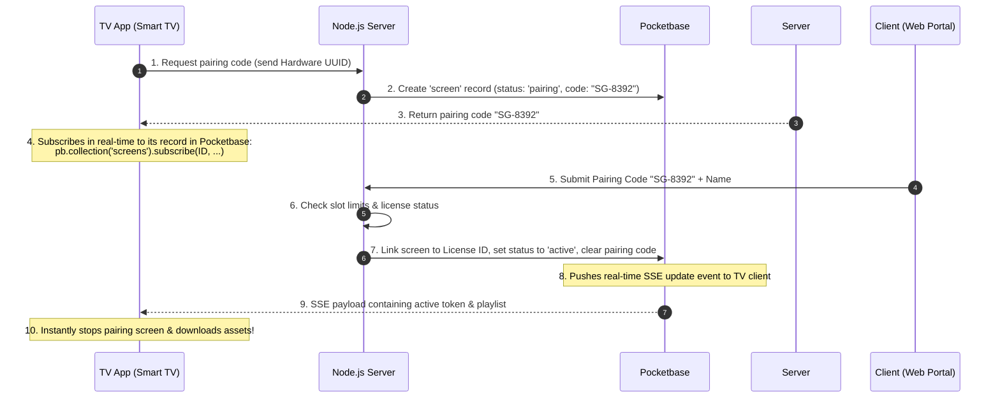

# SignageOS TV Player App Spec — Pocketbase + Node.js Stack

This document specifies the technical architecture, database schemas, and pairing flows for the **SignageOS TV Signage App**, using **Pocketbase** as the real-time database/file-host and a **Node.js server** as the business application orchestrator.

---

## 1. System Architecture

By using **Pocketbase** alongside a **Node.js server**, the app benefits from SQLite performance, file hosting, and native **real-time subscriptions (Server-Sent Events)**, which replace periodic device polling.

```
┌────────────────────────┐
│  SignageOS TV App      │◀─── Real-time SSE Sync (Pocketbase Client SDK)
│  (Android TV / WebOS)  │─── Heartbeat / Diagnostics (Node.js API)
└────────────────────────┘
            │
            ▼
┌────────────────────────┐         ┌────────────────────────┐
│  Node.js API Server    │────────▶│  Pocketbase Backend    │
│  (Razorpay Webhooks,   │  REST   │  (SQLite DB, SSE,      │
│   Auth, License Logic) │  Auth   │   Media Storage)       │
└────────────────────────┘         └────────────────────────┘
```

---

## 2. Pocketbase Collection Schemas (DB)

### 1. `licenses` (License Records)
Stores contract pricing, tenure, and client email links.
* **Fields**:
  * `id`: Text (Primary Key)
  * `name`: Text (e.g. "Pro License for Phoenix Mall")
  * `client_email`: Email (assignedUserEmail)
  * `price`: Number (custom set per client)
  * `tenure`: Select (`monthly`, `yearly`)
  * `status`: Select (`active`, `expired`, `pending_payment`)
  * `expiry_date`: DateTime
  * `device_limit`: Number (maximum screen slots allowed)
  * `storage_limit`: Number (in GB)

### 2. `screens` (TV Devices)
Tracks active player hardware linked to licenses.
* **Fields**:
  * `id`: Text (UUID generated by client)
  * `name`: Text (e.g. "Lobby Main Entrance")
  * `pairing_code`: Text (6-digit alphanumeric)
  * `pairing_code_expires`: DateTime
  * `hardware_uuid`: Text (Unique TV MAC or board ID)
  * `status`: Select (`pairing`, `active`, `suspended`, `offline`)
  * `license_id`: Relation (points to `licenses`)
  * `assigned_playlist_id`: Relation (points to `playlists`)
  * `last_heartbeat`: DateTime

### 3. `playlists` (Media Lists)
Groups media sequences.
* **Fields**:
  * `id`: Text (Primary Key)
  * `name`: Text
  * `media_files`: Relation List (points to `media`)
  * `durations`: Json (array of display durations in seconds per file)

### 4. `media` (Asset Files)
Pocketbase handles native file storage and static URLs out of the box.
* **Fields**:
  * `id`: Text (Primary Key)
  * `title`: Text
  * `file`: File (image/video binary)
  * `size`: Number (in bytes)

---

## 3. Real-time Device Pairing Flow

Rather than polling, the TV Client uses the **Pocketbase Javascript SDK** to subscribe to its row in the `screens` collection, causing the TV to activate instantly the moment pairing is completed in the web browser.



---

## 4. Key Node.js Server Responsibilities

The Node.js server acts as an orchestrator for operations requiring secure keys or server-side checks.

### 1. Pairing Controller (`POST /api/pair`)
Called when a client enters the pairing code in the Web Portal:
* Queries Pocketbase `licenses` using the logged-in client's email to verify screen slots (`screens.count < licenses.device_limit`).
* Locates the `screens` record with matching `pairing_code`.
* Updates that screen record's status to `active`, assigns `license_id`, and sets the screen name.

### 2. Razorpay Renewal Webhook
Handles manual pay-to-renew callbacks from Razorpay:
* Listens to the `payment.captured` webhook.
* Extends the `expiry_date` on the client's `licenses` record in Pocketbase.
* Updates the status from `expired` or `pending_payment` back to `active`.
* *Result*: Since the license is now active, if the Node.js server updates related screen statuses in Pocketbase, all connected TV Apps receive the SSE event in real time and automatically resume signage playback.

### 3. TV Heartbeat Tracker (`POST /api/heartbeat`)
* Receives diagnostics from the TV app (uptime, storage space, current playing track).
* Updates the `last_heartbeat` and `status` fields directly in Pocketbase so the client portal can monitor connectivity.
